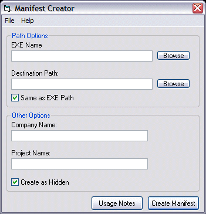



## Manifest Creator \- Have your programs use Themes under Windows XP

### Description

You can make your programs look like true Windows XP programs by adding files called "manifest" files to them. This program provides an easy way to make those files for all of your applications. It includes usage notes on limitations that the manifest files have on them. If you like the code, vote for me please!
 
### More Info
 

             |
---                |---
**Submitted On**   |2001-12-22 22:51:06
**By**             |[Telperion](https://github.com/Planet-Source-Code/PSCIndex/blob/master/ByAuthor/telperion.md)
**Level**          |Beginner
**User Rating**    |5.0 (25 globes from 5 users)
**Compatibility**  |VB 4\.0 \(32\-bit\), VB 6\.0
**Category**       |[Miscellaneous](https://github.com/Planet-Source-Code/PSCIndex/blob/master/ByCategory/miscellaneous__1-1.md)
**World**          |[Visual Basic](https://github.com/Planet-Source-Code/PSCIndex/blob/master/ByWorld/visual-basic.md)
**Archive File**   |[Manifest\_C4367412232001\.zip](https://github.com/Planet-Source-Code/telperion-manifest-creator-have-your-programs-use-themes-under-windows-xp__1-30054/archive/master.zip)

